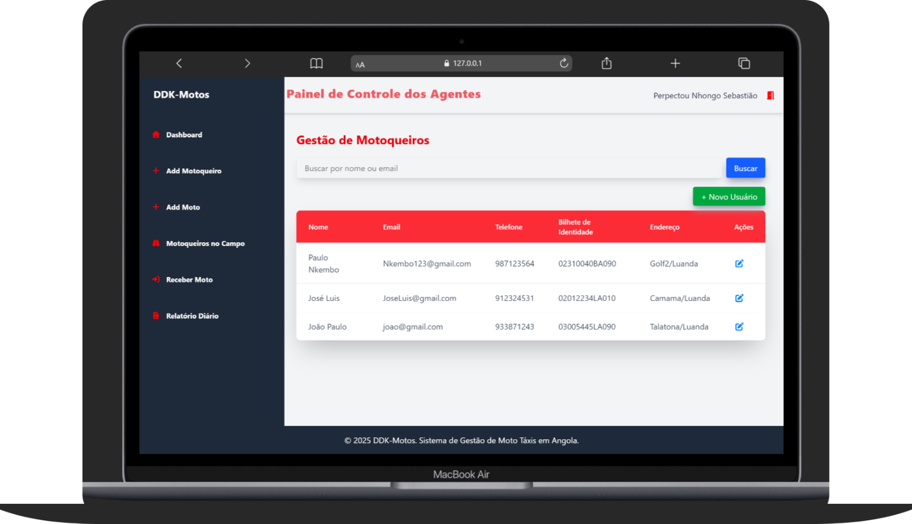

# 🏍️ DDK-Motos

**DDK-Motos** é um sistema de gestão de motorizadas usadas para **moto-táxi**, desenvolvido em **Laravel**.  
O objetivo é facilitar o controle de motos, motoqueiros e receitas diárias, permitindo gerar relatórios rápidos e confiáveis sobre o desempenho do serviço.

---

## 🚀 Funcionalidades

- Cadastro e gestão de **motorizadas** 🚲  
- Cadastro e gestão de **motoqueiros** 👤  
- Associação de moto a motoqueiro  
- Registro de viagens/serviços prestados  
- Relatório diário do faturamento 💰  
- Painel administrativo para acompanhar os dados  
- Exportação de relatórios para análise  

---

### Gestão de motos ou motoqueiros



## 🛠️ Tecnologias utilizadas

- [Laravel](https://laravel.com/) - Framework PHP  
- [MySQL](https://www.mysql.com/) - Banco de dados relacional  
- [Blade](https://laravel.com/docs/blade) - Template engine  
- [Tailwind](https://tailwindcss.com/) - (front-end)  

---

## 📦 Instalação

Clone o repositório:
```bash
git clone https://github.com/seu-usuario/ddk-motos.git

---
cd ddk-motos
---
composer install
npm install && npm run dev

---
cp .env.example .env

---
php artisan key:generate
php artisan migrate
php artisan serve
